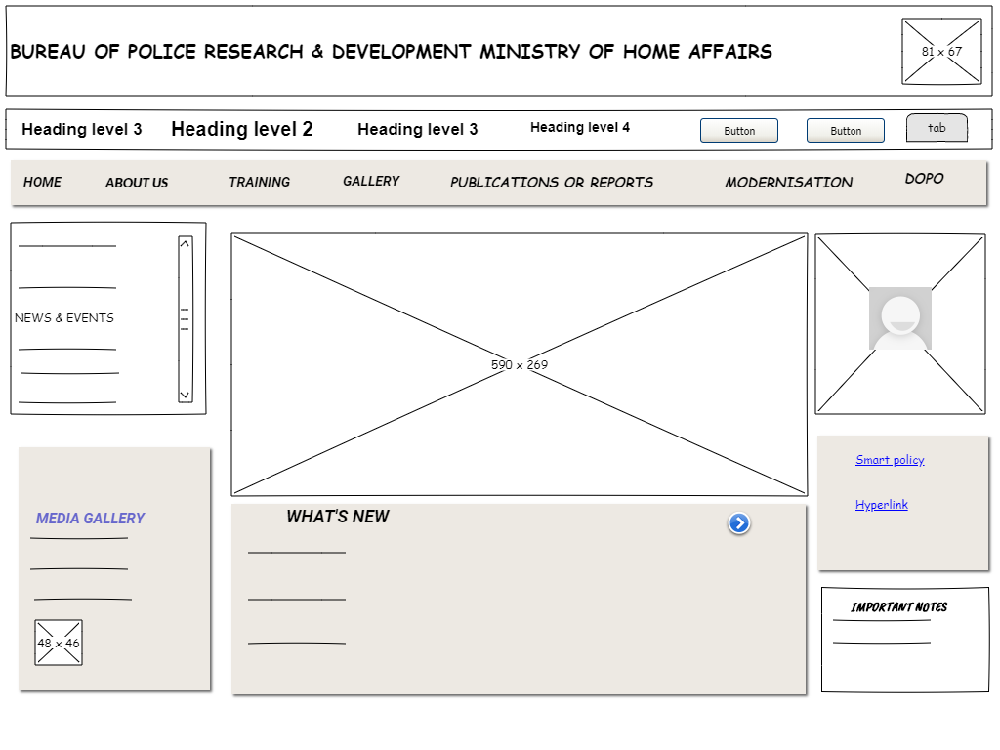
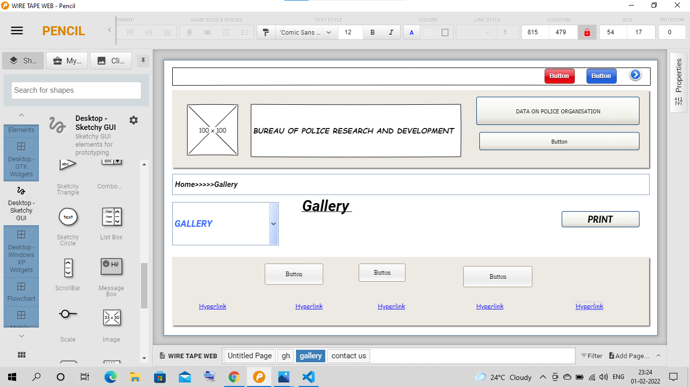
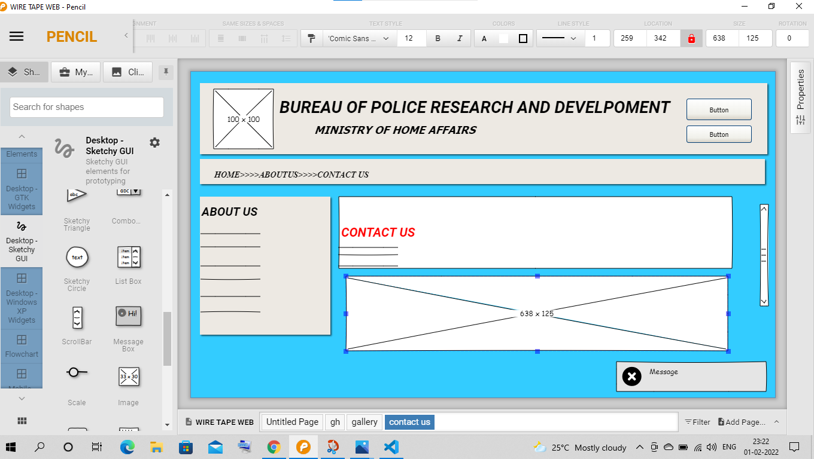

# Wire frame for a website

## AIM:
To design a wire frame for a website.

## DESIGN STEPS:

### Step 1:
Install Pencil software to design a wire frame for the website

### Step 2:
Use appropriate tools in the pencil to create a wire frame

## OUTPUT:
HOME PAGE:

GALLERY PAGE:

CONTACTUS PAGE:

## Result:
Thus a wire frame is designed for a given website.
